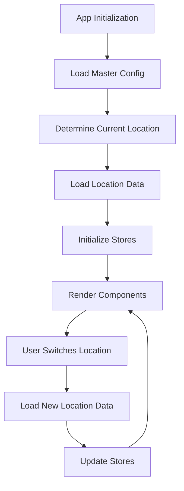

# 🏔️ The Greenville Social - Comprehensive Documentation

A sophisticated Progressive Web App showcasing luxury lifestyle experiences with a **dynamic configuration system** that makes it easily adaptable to any city or region. This comprehensive guide covers every aspect of the application from architecture to deployment.

## Table of Contents

1. [Application Overview](#-application-overview)
2. [Architecture & Technical Stack](#-architecture--technical-stack)
3. [Dynamic Configuration System](#-dynamic-configuration-system)
4. [Business Logic & Data Management](#-business-logic--data-management)
5. [UI Framework & Styling](#-ui-framework--styling)
6. [Progressive Web App Features](#-progressive-web-app-features)
7. [Development Workflow](#-development-workflow)
8. [Deployment & Scaling](#-deployment--scaling)
9. [Content Management](#-content-management)
10. [Mobile Optimization](#-mobile-optimization)
11. [Performance & Analytics](#-performance--analytics)
12. [Troubleshooting & Maintenance](#-troubleshooting--maintenance)

---

## 🎯 Application Overview

### Core Concept

**The Greenville Social** is a **location-agnostic lifestyle directory** that revolutionizes how lifestyle apps are deployed and managed. Instead of building separate apps for each city, this system uses a dynamic configuration approach that allows the entire application to be customized for any location through JSON files alone.

### Key Innovation: Zero-Code Deployment

The app's revolutionary configuration system enables:
- **Deploy to any city** by updating JSON configuration files
- **No code changes required** for new locations
- **Multi-location support** with instant city switching
- **Location-aware branding** and content adaptation

### Target Audience

- **Premium lifestyle consumers** seeking curated experiences
- **Local business owners** wanting sophisticated digital presence
- **Entrepreneurs** looking to launch lifestyle apps in new markets
- **Developers** needing scalable, configurable applications

### Business Model

- **Three-tier business classification** (Signature, Premier, Curated)
- **Lead generation system** for business inquiries
- **Interstitial advertising** opportunities
- **White-label deployment** potential

---

## 🏗️ Architecture & Technical Stack

### Frontend Architecture

```
Vue 3 Composition API
├── Reactive Configuration System
├── Dynamic State Management (Pinia)
├── Client-Side Routing (Vue Router 4)
└── Component-Based Architecture
```

### Core Technologies

#### Frontend Framework
- **Vue 3** - Latest stable version with Composition API
  - `<script setup>` syntax for cleaner components
  - Reactive refs and computed properties
  - Lifecycle hooks integration
  - TypeScript ready (currently JavaScript)

#### Build System
- **Vite 4** - Lightning-fast build tool
  - Hot Module Replacement (HMR)
  - ES modules native support
  - Plugin ecosystem integration
  - Development server optimization

#### State Management
- **Pinia** - Modern Vuex replacement
  - Composition API integration
  - TypeScript support
  - Devtools integration
  - Location-aware stores

#### Routing
- **Vue Router 4** - Official routing solution
  - Dynamic route parameters
  - Route guards
  - Lazy loading
  - History mode

### Application Structure

```
src/
├── 📁 views/                    # Page Components
│   ├── HomeView.vue            # Dynamic home page
│   ├── CategoryListingView.vue # Business listings
│   └── BusinessDetailView.vue  # Individual business pages
│
├── 📁 components/              # Reusable Components
│   ├── 📁 Navigation/         # Navigation components
│   │   ├── AppHeader.vue      # Main app header
│   │   ├── MainNavigation.vue # Primary navigation
│   │   └── CategoryTabs.vue   # Category navigation
│   │
│   ├── 📁 Business/           # Business-related components
│   │   ├── BusinessCard.vue   # Business listing card
│   │   ├── BusinessModal.vue  # Business detail modal
│   │   └── ContactForm.vue    # Lead generation form
│   │
│   └── 📁 UI/                 # Base UI components
│       ├── BaseButton.vue     # Button component
│       ├── BaseModal.vue      # Modal component
│       └── LoadingSpinner.vue # Loading states
│
├── 📁 composables/            # Composition Functions
│   ├── useAppConfig.js        # Configuration management
│   ├── useGeolocation.js      # Location services
│   └── useAnalytics.js        # Analytics tracking
│
├── 📁 stores/                 # Pinia Stores
│   ├── dynamicBusinessStore.js # Business data management
│   ├── dynamicEventsStore.js   # Events data management
│   └── appConfigStore.js       # Configuration state
│
└── 📁 assets/                 # Static Assets
    ├── 📁 styles/            # FLOZ CSS Framework
    ├── 📁 images/            # Application images
    └── 📁 icons/             # Icon assets
```

---

## 🌍 Dynamic Configuration System

### System Architecture

The dynamic configuration system is the core innovation that enables zero-code deployment to new cities. It consists of three layers:

#### 1. Master Configuration Layer
- **File**: `public/config/app-config.json`
- **Purpose**: Global app settings, branding, navigation structure
- **Scope**: Application-wide settings that apply to all locations

#### 2. Location Data Layer
- **Files**: `public/config/locations/{city}/businesses.json`, `events.json`
- **Purpose**: Location-specific business and event data
- **Scope**: City-specific content and listings

#### 3. Runtime Configuration Layer
- **Composable**: `src/composables/useAppConfig.js`
- **Purpose**: Dynamic loading and switching between configurations
- **Scope**: Real-time configuration management

### Configuration Flow



### Master Configuration Schema

```json
{
  "app": {
    "name": "The Greenville Social",
    "shortName": "Greenville Social",
    "tagline": "Mountain community lifestyle for Greenville residents",
    "description": "Exclusive access • Private clubs • Dining",
    "version": "1.0.0",
    "
": {
      "primaryColor": "#D4AF37",
      "secondaryColor": "#2F5233",
      "logoLight": "/images/white.png",
      "logoDark": "/images/green.png"
    },
    "location": {
      "city": "Greenville",
      "state": "South Carolina",
      "country": "United States",
      "timezone": "America/New_York",
      "coordinates": {
        "lat": 34.8526,
        "lng": -82.3940
      }
    }
  },
  "navigation": {
    "categories": [
      {
        "id": "dining",
        "name": "Dining",
        "displayName": "DINING",
        "featured": true,
        "image": "https://images.unsplash.com/...",
        "order": 1,
        "color": "#8B4513"
      }
    ]
  },
  "features": {
    "leadGeneration": true,
    "eventCalendar": true,
    "businessRatings": true,
    "mapIntegration": true,
    "offlineSupport": true
  }
}
```

### Location Data Schema

#### Business Data Structure
```json
{
  "location": "greenville",
  "lastUpdated": "2025-01-15T00:00:00Z",
  "businessCount": 8,
  "businesses": [
    {
      "id": 1,
      "name": "The Lazy Goat",
      "category": "Dining",
      "subcategory": "Mediterranean",
      "tier": "signature",
      "description": "Upscale Mediterranean restaurant with riverside dining",
      "longDescription": "The Lazy Goat offers...",

      "location": {
        "address": "170 River St, Greenville, SC 29601",
        "lat": 34.8479,
        "lng": -82.3967,
        "neighborhood": "Downtown",
        "parkingAvailable": true,
        "publicTransport": true
      },

      "contact": {
        "phone": "(864) 679-5299",
        "website": "https://thelazygoat.com",
        "email": "info@thelazygoat.com",
        "reservations": "https://resy.com/cities/greenville-sc/the-lazy-goat"
      },

      "hours": {
        "monday": "Closed",
        "tuesday": "5:00 PM - 10:00 PM",
        "wednesday": "5:00 PM - 10:00 PM",
        "thursday": "5:00 PM - 10:00 PM",
        "friday": "5:00 PM - 11:00 PM",
        "saturday": "5:00 PM - 11:00 PM",
        "sunday": "5:00 PM - 9:00 PM"
      },

      "pricing": {
        "range": "$$$$",
        "averageMeal": 65,
        "currency": "USD"
      },

      "features": [
        "Fine Dining",
        "Wine Selection",
        "Outdoor Seating",
        "Private Events",
        "Valet Parking"
      ],

      "images": [
        "https://images.unsplash.com/photo-1517248135467-4c7edcad34c4",
        "https://images.unsplash.com/photo-1414235077428-338989a2e8c0"
      ],

      "rating": 4.8,
      "reviewCount": 245,
      "verified": true,
      "featured": true,
      "promoted": false
    }
  ]
}
```

#### Event Data Structure
```json
{
  "location": "greenville",
  "lastUpdated": "2025-01-15T00:00:00Z",
  "events": [
    {
      "id": 1,
      "name": "Wine Tasting at The Lazy Goat",
      "slug": "wine-tasting-lazy-goat-feb-2025",
      "date": "2025-02-15",
      "time": "7:00 PM",
      "endTime": "9:00 PM",
      "category": "Food & Wine",
      "tier": "signature",
      "venue": "The Lazy Goat",
      "venueId": 1,
      "description": "Exclusive wine tasting featuring rare vintages",
      "price": 85,
      "capacity": 30,
      "availability": "Limited",
      "requiresReservation": true,
      "dresscode": "Business Casual"
    }
  ]
}
```

### Configuration Management API

#### useAppConfig Composable

```javascript
import { ref, computed, watch } from 'vue'

export const useAppConfig = () => {
  // Reactive state
  const currentLocation = ref('greenville')
  const isLoading = ref(false)
  const appConfig = ref(null)
  const locationData = ref({})

  // Computed getters
  const getAppInfo = computed(() => appConfig.value?.app)
  const getCategories = computed(() => appConfig.value?.navigation?.categories || [])
  const getCurrentBusinesses = computed(() => locationData.value.businesses || [])
  const getCurrentEvents = computed(() => locationData.value.events || [])

  // Methods
  const initializeApp = async (location = 'greenville') => {
    isLoading.value = true
    try {
      await loadMasterConfig()
      await setLocation(location)
    } catch (error) {
      console.error('Failed to initialize app:', error)
    } finally {
      isLoading.value = false
    }
  }

  const loadMasterConfig = async () => {
    const response = await fetch('/config/app-config.json')
    appConfig.value = await response.json()
  }

  const setLocation = async (location) => {
    currentLocation.value = location
    await loadLocationData(location)
  }

  const loadLocationData = async (location) => {
    const [businessesResponse, eventsResponse] = await Promise.all([
      fetch(`/config/locations/${location}/businesses.json`),
      fetch(`/config/locations/${location}/events.json`)
    ])

    locationData.value = {
      businesses: await businessesResponse.json(),
      events: await eventsResponse.json()
    }
  }

  return {
    // State
    currentLocation,
    isLoading,
    appConfig,

    // Methods
    initializeApp,
    setLocation,

    // Getters
    getAppInfo,
    getCategories,
    getCurrentBusinesses,
    getCurrentEvents
  }
}
```

---

## 💼 Business Logic & Data Management

### Store Architecture

The application uses Pinia for state management with location-aware stores that automatically adapt to configuration changes.

#### Dynamic Business Store

```javascript
import { defineStore } from 'pinia'
import { useAppConfig } from '@/composables/useAppConfig'

export const useDynamicBusinessStore = defineStore('dynamicBusiness', () => {
  const { getCurrentBusinesses } = useAppConfig()

  // State
  const businesses = ref([])
  const loading = ref(false)
  const error = ref(null)

  // Getters
  const getBusinessesByCategory = computed(() => (category) => {
    return businesses.value.filter(business => business.category === category)
  })

  const getFeaturedBusinesses = computed(() => {
    return businesses.value.filter(business => business.featured === true)
  })

  const getBusinessesByTier = computed(() => (tier) => {
    return businesses.value.filter(business => business.tier === tier)
  })

  const getSignatureBusinesses = computed(() => getBusinessesByTier.value('signature'))
  const getPremierBusinesses = computed(() => getBusinessesByTier.value('premier'))
  const getCuratedBusinesses = computed(() => getBusinessesByTier.value('curated'))

  // Actions
  const loadData = async () => {
    loading.value = true
    error.value = null

    try {
      businesses.value = getCurrentBusinesses.value.businesses || []
    } catch (err) {
      error.value = err.message
    } finally {
      loading.value = false
    }
  }

  const switchLocation = async (location) => {
    await setLocation(location)
    await loadData()
  }

  const searchBusinesses = (query) => {
    const searchTerm = query.toLowerCase()
    return businesses.value.filter(business =>
      business.name.toLowerCase().includes(searchTerm) ||
      business.description.toLowerCase().includes(searchTerm) ||
      business.features.some(feature => feature.toLowerCase().includes(searchTerm))
    )
  }

  return {
    // State
    businesses,
    loading,
    error,

    // Getters
    getBusinessesByCategory,
    getFeaturedBusinesses,
    getBusinessesByTier,
    getSignatureBusinesses,
    getPremierBusinesses,
    getCuratedBusinesses,

    // Actions
    loadData,
    switchLocation,
    searchBusinesses
  }
})
```

### Business Tier System

#### Tier Classifications

1. **Signature Tier**
   - Premium featured businesses
   - Enhanced visibility and positioning
   - Special promotional opportunities
   - Exclusive event access

2. **Premier Tier**
   - High-quality businesses
   - Good positioning in listings
   - Standard promotional features
   - Priority in search results

3. **Curated Tier**
   - Vetted standard listings
   - Basic listing features
   - Included in category views
   - Standard search visibility

#### Tier-Based Features

```javascript
const getTierFeatures = (tier) => {
  const features = {
    signature: {
      priority: 1,
      featuredInHome: true,
      enhancedListing: true,
      specialBadge: true,
      promotionalSlots: 3,
      analyticsAccess: 'full'
    },
    premier: {
      priority: 2,
      featuredInHome: false,
      enhancedListing: true,
      specialBadge: true,
      promotionalSlots: 1,
      analyticsAccess: 'basic'
    },
    curated: {
      priority: 3,
      featuredInHome: false,
      enhancedListing: false,
      specialBadge: false,
      promotionalSlots: 0,
      analyticsAccess: 'none'
    }
  }

  return features[tier] || features.curated
}
```

### Lead Generation System

#### Contact Form Integration

```javascript
const useLeadGeneration = () => {
  const submitLead = async (businessId, formData) => {
    const lead = {
      businessId,
      timestamp: new Date().toISOString(),
      source: 'webapp',
      ...formData
    }

    // Analytics tracking
    trackEvent('lead_generated', {
      business_id: businessId,
      business_tier: getBusiness(businessId).tier,
      form_type: formData.type
    })

    // Submit to backend/CRM
    await fetch('/api/leads', {
      method: 'POST',
      headers: { 'Content-Type': 'application/json' },
      body: JSON.stringify(lead)
    })
  }

  return { submitLead }
}
```

---

## 🎨 UI Framework & Styling

### FLOZ CSS Framework

The application uses a custom CSS framework called **FLOZ** that provides:
- **Design system consistency**
- **Component-based styles**
- **Responsive utilities**
- **Dynamic theming support**

#### Framework Structure

```
assets/styles/
├── 📄 main.css              # Main stylesheet entry
├── 📄 variables.css         # CSS custom properties
├── 📄 base.css             # Base styles and resets
├── 📄 components.css       # Component styles
├── 📄 utilities.css        # Utility classes
└── 📄 responsive.css       # Media queries
```

#### CSS Variables System

```css
:root {
  /* Brand Colors */
  --color-primary: #D4AF37;        /* Gold */
  --color-secondary: #2F5233;      /* Forest Green */
  --color-accent: #8B4513;         /* Saddle Brown */

  /* Neutral Colors */
  --color-background: #FFFFFF;
  --color-surface: #F8F9FA;
  --color-text-primary: #2D3748;
  --color-text-secondary: #718096;

  /* Semantic Colors */
  --color-success: #48BB78;
  --color-warning: #ED8936;
  --color-error: #F56565;
  --color-info: #4299E1;

  /* Typography */
  --font-family-primary: 'Inter', -apple-system, BlinkMacSystemFont, sans-serif;
  --font-family-heading: 'Playfair Display', serif;

  /* Spacing Scale */
  --spacing-xs: 0.25rem;    /* 4px */
  --spacing-sm: 0.5rem;     /* 8px */
  --spacing-md: 1rem;       /* 16px */
  --spacing-lg: 1.5rem;     /* 24px */
  --spacing-xl: 2rem;       /* 32px */
  --spacing-2xl: 3rem;      /* 48px */

  /* Breakpoints */
  --breakpoint-sm: 640px;
  --breakpoint-md: 768px;
  --breakpoint-lg: 1024px;
  --breakpoint-xl: 1280px;
}
```

#### Dynamic Theming

```css
/* Location-aware theming */
[data-location="greenville"] {
  --color-primary: #D4AF37;
  --color-secondary: #2F5233;
  --brand-font: 'Playfair Display', serif;
}

[data-location="charleston"] {
  --color-primary: #1E3A8A;
  --color-secondary: #DC2626;
  --brand-font: 'Crimson Text', serif;
}
```

#### Component Styling System

```css
/* Business Card Component */
.business-card {
  background: var(--color-surface);
  border-radius: var(--border-radius-lg);
  padding: var(--spacing-lg);
  box-shadow: var(--shadow-md);
  transition: var(--transition-default);
}

.business-card:hover {
  transform: translateY(-2px);
  box-shadow: var(--shadow-lg);
}

.business-card__tier--signature {
  border-top: 4px solid var(--color-primary);
}

.business-card__tier--premier {
  border-top: 4px solid var(--color-secondary);
}

.business-card__tier--curated {
  border-top: 4px solid var(--color-accent);
}
```

#### Responsive Design System

```css
/* Mobile-first responsive utilities */
.container {
  width: 100%;
  max-width: 1200px;
  margin: 0 auto;
  padding: 0 var(--spacing-md);
}

@media (min-width: 640px) {
  .container {
    padding: 0 var(--spacing-lg);
  }
}

@media (min-width: 1024px) {
  .container {
    padding: 0 var(--spacing-xl);
  }
}

/* Responsive grid system */
.grid {
  display: grid;
  gap: var(--spacing-md);
  grid-template-columns: 1fr;
}

@media (min-width: 768px) {
  .grid--2-cols {
    grid-template-columns: repeat(2, 1fr);
  }
}

@media (min-width: 1024px) {
  .grid--3-cols {
    grid-template-columns: repeat(3, 1fr);
  }
}
```

---

## 📱 Progressive Web App Features

### PWA Configuration

The application is fully configured as a Progressive Web App with comprehensive offline support and native app-like features.

#### Manifest Configuration

```json
{
  "name": "The Greenville Social",
  "short_name": "Greenville Social",
  "description": "Mountain community lifestyle for Greenville residents",
  "theme_color": "#D4AF37",
  "background_color": "#FFFFFF",
  "display": "standalone",
  "orientation": "portrait-primary",
  "scope": "/",
  "start_url": "/",
  "categories": ["lifestyle", "business", "entertainment"],
  "lang": "en-US",
  "dir": "ltr",
  "icons": [
    {
      "src": "/pwa-64x64.png",
      "sizes": "64x64",
      "type": "image/png"
    },
    {
      "src": "/pwa-192x192.png",
      "sizes": "192x192",
      "type": "image/png"
    },
    {
      "src": "/pwa-512x512.png",
      "sizes": "512x512",
      "type": "image/png",
      "purpose": "any maskable"
    }
  ]
}
```

#### Service Worker Strategy

```javascript
// vite.config.js PWA configuration
import { VitePWA } from 'vite-plugin-pwa'

export default defineConfig({
  plugins: [
    vue(),
    VitePWA({
      registerType: 'autoUpdate',
      workbox: {
        globPatterns: ['**/*.{js,css,html,ico,png,svg,json}'],
        runtimeCaching: [
          {
            urlPattern: /^https:\/\/api\.*/i,
            handler: 'CacheFirst',
            options: {
              cacheName: 'api-cache',
              expiration: {
                maxEntries: 100,
                maxAgeSeconds: 60 * 60 * 24 * 7 // 7 days
              }
            }
          },
          {
            urlPattern: /^https:\/\/images\.unsplash\.com/,
            handler: 'CacheFirst',
            options: {
              cacheName: 'image-cache',
              expiration: {
                maxEntries: 60,
                maxAgeSeconds: 60 * 60 * 24 * 30 // 30 days
              }
            }
          }
        ]
      }
    })
  ]
})
```

### Offline Functionality

#### Offline Data Strategy

```javascript
const useOfflineSupport = () => {
  const isOnline = ref(navigator.onLine)
  const cachedData = ref({})

  // Cache configuration data
  const cacheConfiguration = async () => {
    const config = await loadAppConfig()
    localStorage.setItem('app-config', JSON.stringify(config))

    const businessData = await loadBusinessData()
    localStorage.setItem('business-data', JSON.stringify(businessData))
  }

  // Load from cache when offline
  const loadCachedData = () => {
    if (!isOnline.value) {
      const config = localStorage.getItem('app-config')
      const businesses = localStorage.getItem('business-data')

      if (config && businesses) {
        cachedData.value = {
          config: JSON.parse(config),
          businesses: JSON.parse(businesses)
        }
      }
    }
  }

  // Listen for online/offline events
  window.addEventListener('online', () => {
    isOnline.value = true
    // Sync cached changes when back online
    syncOfflineChanges()
  })

  window.addEventListener('offline', () => {
    isOnline.value = false
  })

  return {
    isOnline,
    cachedData,
    cacheConfiguration,
    loadCachedData
  }
}
```

---

## 🚀 Development Workflow

### Local Development Setup

#### Prerequisites
- Node.js 18+ and npm
- Git for version control
- Modern browser with dev tools

#### Installation Process

```bash
# 1. Clone the repository
git clone <repository-url>
cd FLOZ-GS

# 2. Install dependencies
npm install

# 3. Start development server
npm run dev

# 4. Open browser
# Navigate to http://localhost:5173
```

#### Development Scripts

```json
{
  "scripts": {
    "dev": "vite --host",
    "build": "vite build",
    "preview": "vite preview",
    "icons": "pwa-assets-generator",
    "clean": "rm -rf dist node_modules/.vite",
    "reset": "npm run clean && npm install",
    "lint": "eslint src --ext .vue,.js",
    "lint:fix": "eslint src --ext .vue,.js --fix",
    "type-check": "vue-tsc --noEmit"
  }
}
```

### Development Best Practices

#### Component Development

```vue
<!-- BusinessCard.vue -->
<template>
  <article
    class="business-card"
    :class="`business-card--${business.tier}`"
    @click="openBusinessModal"
  >
    <header class="business-card__header">
      <h3 class="business-card__name">{{ business.name }}</h3>
      <span class="business-card__tier-badge">{{ business.tier }}</span>
    </header>

    <div class="business-card__content">
      <p class="business-card__description">{{ business.description }}</p>
      <div class="business-card__features">
        <span
          v-for="feature in business.features"
          :key="feature"
          class="feature-tag"
        >
          {{ feature }}
        </span>
      </div>
    </div>

    <footer class="business-card__footer">
      <div class="business-card__rating">
        <StarRating :rating="business.rating" />
        <span class="review-count">({{ business.reviewCount }})</span>
      </div>
      <span class="business-card__price">{{ business.priceRange }}</span>
    </footer>
  </article>
</template>

<script setup>
import { defineProps, defineEmits } from 'vue'
import StarRating from '@/components/UI/StarRating.vue'

const props = defineProps({
  business: {
    type: Object,
    required: true
  }
})

const emit = defineEmits(['open-modal'])

const openBusinessModal = () => {
  emit('open-modal', props.business)
}
</script>

<style scoped>
.business-card {
  /* Component styles */
}
</style>
```

#### Store Integration

```javascript
// In a Vue component
<script setup>
import { computed, onMounted } from 'vue'
import { useDynamicBusinessStore } from '@/stores/dynamicBusinessStore'
import { useAppConfig } from '@/composables/useAppConfig'

const businessStore = useDynamicBusinessStore()
const { initializeApp } = useAppConfig()

// Reactive data
const businesses = computed(() => businessStore.businesses)
const loading = computed(() => businessStore.loading)
const featuredBusinesses = computed(() => businessStore.getFeaturedBusinesses)

// Lifecycle
onMounted(async () => {
  await initializeApp()
  await businessStore.loadData()
})
</script>
```

### Testing Strategy

#### Unit Testing with Vitest

```javascript
// tests/components/BusinessCard.test.js
import { describe, it, expect } from 'vitest'
import { mount } from '@vue/test-utils'
import BusinessCard from '@/components/Business/BusinessCard.vue'

describe('BusinessCard', () => {
  const mockBusiness = {
    id: 1,
    name: 'Test Restaurant',
    tier: 'signature',
    description: 'Test description',
    features: ['Fine Dining', 'Wine Bar'],
    rating: 4.5,
    reviewCount: 100,
    priceRange: '$$$$'
  }

  it('renders business information correctly', () => {
    const wrapper = mount(BusinessCard, {
      props: { business: mockBusiness }
    })

    expect(wrapper.find('.business-card__name').text()).toBe('Test Restaurant')
    expect(wrapper.find('.business-card__tier-badge').text()).toBe('signature')
    expect(wrapper.find('.business-card__description').text()).toBe('Test description')
  })

  it('emits open-modal event when clicked', async () => {
    const wrapper = mount(BusinessCard, {
      props: { business: mockBusiness }
    })

    await wrapper.trigger('click')

    expect(wrapper.emitted('open-modal')).toBeTruthy()
    expect(wrapper.emitted('open-modal')[0]).toEqual([mockBusiness])
  })
})
```

---

## 🌐 Deployment & Scaling

### Deployment Options

#### Static Hosting (Recommended)
- **Vercel** - Zero configuration deployment
- **Netlify** - Git-based continuous deployment
- **GitHub Pages** - Free hosting for public repositories
- **AWS S3 + CloudFront** - Enterprise-grade hosting

#### Deployment Process

```bash
# Build for production
npm run build

# Deploy dist/ folder to hosting provider
# The dist/ folder contains the complete static site
```

#### Vercel Deployment

```json
// vercel.json
{
  "builds": [
    {
      "src": "package.json",
      "use": "@vercel/static-build",
      "config": {
        "distDir": "dist"
      }
    }
  ],
  "routes": [
    {
      "src": "/(.*)",
      "dest": "/index.html"
    }
  ]
}
```

### Multi-Location Scaling

#### Subdomain Strategy

```
greenville.theapp.com  → Greenville configuration
charleston.theapp.com  → Charleston configuration
atlanta.theapp.com     → Atlanta configuration
```

#### Implementation

```javascript
// Automatic location detection from hostname
const detectLocationFromHost = () => {
  const hostname = window.location.hostname
  const subdomain = hostname.split('.')[0]

  const locationMap = {
    'greenville': 'greenville',
    'charleston': 'charleston',
    'atlanta': 'atlanta'
  }

  return locationMap[subdomain] || 'greenville'
}

// Initialize with detected location
const { initializeApp } = useAppConfig()
const detectedLocation = detectLocationFromHost()
await initializeApp(detectedLocation)
```

### Environment Configuration

```javascript
// vite.config.js
export default defineConfig({
  define: {
    __APP_VERSION__: JSON.stringify(process.env.npm_package_version),
    __BUILD_TIME__: JSON.stringify(new Date().toISOString()),
    __ENVIRONMENT__: JSON.stringify(process.env.NODE_ENV)
  },
  build: {
    rollupOptions: {
      output: {
        manualChunks: {
          vendor: ['vue', 'vue-router', 'pinia'],
          ui: ['@/components/UI/index.js']
        }
      }
    }
  }
})
```

---

## 📝 Content Management

### Business Data Management

#### Adding New Businesses

1. **Update businesses.json** for the target location:

```json
{
  "businesses": [
    {
      "id": "next_available_id",
      "name": "New Business Name",
      "category": "Select from existing categories",
      "tier": "signature|premier|curated",
      "description": "Brief description (max 150 characters)",
      "longDescription": "Detailed description for modal view",

      "location": {
        "address": "Full street address",
        "lat": "GPS latitude (decimal)",
        "lng": "GPS longitude (decimal)",
        "neighborhood": "Area/district name"
      },

      "contact": {
        "phone": "(xxx) xxx-xxxx",
        "website": "https://business-website.com",
        "email": "contact@business.com"
      },

      "hours": {
        "monday": "Hours or 'Closed'",
        "tuesday": "Hours",
        "wednesday": "Hours",
        "thursday": "Hours",
        "friday": "Hours",
        "saturday": "Hours",
        "sunday": "Hours"
      },

      "features": ["Feature 1", "Feature 2", "Feature 3"],
      "priceRange": "$|$$|$$$|$$$$",
      "rating": 4.5,
      "reviewCount": 100,
      "images": ["image_url_1", "image_url_2"]
    }
  ]
}
```

2. **Validate data structure** using the schema
3. **Test locally** before deployment
4. **Deploy** configuration files

#### Content Guidelines

##### Business Descriptions
- **Brief description**: 50-150 characters, compelling and descriptive
- **Long description**: 200-500 words, detailed experience description
- **Features**: 3-8 key amenities or specialties
- **Consistent tone**: Premium, sophisticated, locally relevant

##### Image Requirements
- **Primary image**: 1200x800px minimum, business exterior or signature dish
- **Secondary images**: Interior, food, ambiance shots
- **Format**: JPG or WebP for optimization
- **Aspect ratio**: 3:2 preferred for consistency

##### Category Management

```json
// Adding new categories to app-config.json
{
  "navigation": {
    "categories": [
      {
        "id": "new-category",
        "name": "New Category",
        "displayName": "NEW CATEGORY",
        "featured": false,
        "image": "https://images.unsplash.com/photo-...",
        "order": 5,
        "color": "#8B4513",
        "description": "Category description for SEO"
      }
    ]
  }
}
```

### Event Management

#### Event Data Structure

```json
{
  "events": [
    {
      "id": "unique_event_id",
      "name": "Event Name",
      "slug": "url-friendly-event-name",
      "date": "2025-03-15",
      "time": "7:00 PM",
      "endTime": "10:00 PM",
      "timezone": "America/New_York",

      "category": "Food & Wine|Entertainment|Wellness|Business",
      "tier": "signature|premier|curated",
      "recurring": false,
      "recurringPattern": "weekly|monthly|yearly",

      "venue": "Business Name",
      "venueId": "corresponding_business_id",
      "location": {
        "address": "Event address if different from venue",
        "lat": 34.8479,
        "lng": -82.3967
      },

      "description": "Brief event description",
      "longDescription": "Detailed event information",
      "highlights": ["Highlight 1", "Highlight 2"],

      "pricing": {
        "general": 50,
        "member": 40,
        "currency": "USD",
        "includes": "What's included in price"
      },

      "capacity": 50,
      "availability": "Available|Limited|Sold Out",
      "requiresReservation": true,
      "reservationUrl": "https://booking-link.com",

      "dresscode": "Casual|Business Casual|Cocktail|Black Tie",
      "ageRestriction": "21+|18+|All Ages",

      "images": ["event_image_1.jpg", "event_image_2.jpg"],
      "featured": true
    }
  ]
}
```

#### Content Automation

```javascript
// Event status automation
const updateEventStatus = () => {
  const events = getCurrentEvents.value
  const now = new Date()

  events.forEach(event => {
    const eventDate = new Date(event.date)

    if (eventDate < now) {
      event.status = 'past'
    } else if (event.availability === 'Sold Out') {
      event.status = 'sold-out'
    } else if (isWithinDays(eventDate, 7)) {
      event.status = 'upcoming'
    } else {
      event.status = 'future'
    }
  })
}
```

---

## 📱 Mobile Optimization

### Mobile-First Design Principles

The application follows a strict mobile-first approach with progressive enhancement for larger screens:

#### Touch Interface Guidelines

1. **Touch Target Size**: Minimum 44px for all interactive elements
2. **Touch Spacing**: 8px minimum between adjacent touch targets
3. **Gesture Support**: Swipe navigation where appropriate
4. **Visual Feedback**: Immediate response to touch interactions

```css
/* Touch-optimized button styles */
.btn {
  min-height: 44px;
  min-width: 44px;
  padding: 12px 24px;
  border-radius: 8px;
  font-size: 16px; /* Prevents zoom on iOS */
  -webkit-tap-highlight-color: transparent;
}

.btn:active {
  transform: scale(0.98);
  transition: transform 0.1s ease;
}
```

#### Responsive Breakpoints

```css
/* Mobile First Media Queries */
.container {
  padding: 16px;
}

/* Tablet */
@media (min-width: 768px) {
  .container {
    padding: 24px;
    max-width: 768px;
    margin: 0 auto;
  }
}

/* Desktop */
@media (min-width: 1024px) {
  .container {
    padding: 32px;
    max-width: 1200px;
  }
}

/* Large Desktop */
@media (min-width: 1440px) {
  .container {
    max-width: 1400px;
  }
}
```

### Performance Optimization

#### Core Web Vitals Targets

- **First Contentful Paint (FCP)**: < 1.8 seconds
- **Largest Contentful Paint (LCP)**: < 2.5 seconds
- **First Input Delay (FID)**: < 100 milliseconds
- **Cumulative Layout Shift (CLS)**: < 0.1

#### Implementation Strategies

```javascript
// Image lazy loading with Intersection Observer
const useImageLazyLoading = () => {
  const imageObserver = new IntersectionObserver((entries) => {
    entries.forEach(entry => {
      if (entry.isIntersecting) {
        const img = entry.target
        img.src = img.dataset.src
        img.classList.remove('lazy')
        imageObserver.unobserve(img)
      }
    })
  })

  const observeImages = () => {
    const lazyImages = document.querySelectorAll('img[data-src]')
    lazyImages.forEach(img => imageObserver.observe(img))
  }

  return { observeImages }
}
```

```vue
<!-- Optimized image component -->
<template>
  
</template>

<script setup>
import { ref, onMounted } from 'vue'

const props = defineProps({
  src: String,
  alt: String
})

const loaded = ref(false)

const handleLoad = () => {
  loaded.value = true
}

const handleError = () => {
  console.warn(`Failed to load image: ${props.src}`)
}
</script>
```

### iOS and Android Specific Optimizations

#### iOS Safari Optimizations

```css
/* iOS Safari specific fixes */
body {
  -webkit-text-size-adjust: 100%;
  -webkit-font-smoothing: antialiased;
}

/* Prevent zoom on input focus */
input, textarea, select {
  font-size: 16px;
}

/* iOS safe area support */
.header {
  padding-top: env(safe-area-inset-top);
}

.bottom-nav {
  padding-bottom: env(safe-area-inset-bottom);
}
```

#### Android Chrome Optimizations

```javascript
// Prevent Android address bar scroll behavior
const preventAddressBarJump = () => {
  let ticking = false

  const updateViewport = () => {
    const vh = window.innerHeight * 0.01
    document.documentElement.style.setProperty('--vh', `${vh}px`)
    ticking = false
  }

  const handleResize = () => {
    if (!ticking) {
      requestAnimationFrame(updateViewport)
      ticking = true
    }
  }

  window.addEventListener('resize', handleResize)
  updateViewport()
}
```

---

## 📊 Performance & Analytics

### Performance Monitoring

#### Core Metrics Tracking

```javascript
// Performance monitoring utility
const usePerformanceMonitoring = () => {
  const metrics = ref({})

  const measurePageLoad = () => {
    const navigation = performance.getEntriesByType('navigation')[0]

    metrics.value = {
      dns: navigation.domainLookupEnd - navigation.domainLookupStart,
      connection: navigation.connectEnd - navigation.connectStart,
      request: navigation.responseStart - navigation.requestStart,
      response: navigation.responseEnd - navigation.responseStart,
      domParsing: navigation.domContentLoadedEventStart - navigation.responseEnd,
      domReady: navigation.domContentLoadedEventEnd - navigation.domContentLoadedEventStart,
      pageLoad: navigation.loadEventEnd - navigation.loadEventStart,
      totalTime: navigation.loadEventEnd - navigation.navigationStart
    }
  }

  const measureResourceTiming = () => {
    const resources = performance.getEntriesByType('resource')

    const resourceMetrics = resources.map(resource => ({
      name: resource.name,
      duration: resource.duration,
      size: resource.transferSize,
      type: resource.initiatorType
    }))

    return resourceMetrics
  }

  const measureCoreWebVitals = () => {
    // First Contentful Paint
    const fcpEntry = performance.getEntriesByName('first-contentful-paint')[0]
    if (fcpEntry) {
      metrics.value.fcp = fcpEntry.startTime
    }

    // Largest Contentful Paint
    const observer = new PerformanceObserver((list) => {
      const entries = list.getEntries()
      const lastEntry = entries[entries.length - 1]
      metrics.value.lcp = lastEntry.startTime
    })
    observer.observe({ entryTypes: ['largest-contentful-paint'] })
  }

  return {
    metrics,
    measurePageLoad,
    measureResourceTiming,
    measureCoreWebVitals
  }
}
```

### Analytics Integration

#### Event Tracking System

```javascript
// Analytics composable
const useAnalytics = () => {
  const trackEvent = (eventName, properties = {}) => {
    // Google Analytics 4
    if (typeof gtag !== 'undefined') {
      gtag('event', eventName, {
        ...properties,
        custom_parameter_app_version: __APP_VERSION__,
        custom_parameter_location: getCurrentLocation()
      })
    }

    // Custom analytics endpoint
    fetch('/api/analytics/events', {
      method: 'POST',
      headers: {
        'Content-Type': 'application/json',
      },
      body: JSON.stringify({
        event: eventName,
        properties,
        timestamp: new Date().toISOString(),
        session_id: getSessionId(),
        user_id: getUserId()
      })
    })
  }

  const trackPageView = (pageName, properties = {}) => {
    trackEvent('page_view', {
      page_name: pageName,
      page_location: window.location.href,
      page_title: document.title,
      ...properties
    })
  }

  const trackBusinessInteraction = (businessId, action) => {
    trackEvent('business_interaction', {
      business_id: businessId,
      action: action, // 'view', 'contact', 'direction', 'website'
      business_tier: getBusinessById(businessId).tier
    })
  }

  const trackLocationSwitch = (fromLocation, toLocation) => {
    trackEvent('location_switch', {
      from_location: fromLocation,
      to_location: toLocation,
      switch_method: 'user_selection'
    })
  }

  return {
    trackEvent,
    trackPageView,
    trackBusinessInteraction,
    trackLocationSwitch
  }
}
```

#### Key Performance Indicators

```javascript
// KPI tracking for business insights
const businessKPIs = {
  // User engagement
  sessionDuration: 'Average time spent in app',
  pageViews: 'Number of pages viewed per session',
  returnUsers: 'Percentage of returning users',

  // Business interactions
  businessViews: 'Number of business detail views',
  contactRequests: 'Lead generation form submissions',
  websiteClicks: 'External website visits',
  phoneClicks: 'Phone number taps',
  directionRequests: 'Map direction requests',

  // Location performance
  locationSwitches: 'How often users switch between cities',
  locationRetention: 'User retention per location',

  // Content performance
  categoryPopularity: 'Most viewed business categories',
  tierPerformance: 'Interaction rates by business tier',
  featureUsage: 'Most used app features'
}
```

---

## 🔧 Troubleshooting & Maintenance

### Common Issues and Solutions

#### Configuration Loading Issues

**Problem**: Configuration files not loading or returning 404 errors

```javascript
// Debug configuration loading
const debugConfigLoading = async () => {
  try {
    const response = await fetch('/config/app-config.json')

    if (!response.ok) {
      console.error(`Config loading failed: ${response.status} ${response.statusText}`)

      // Check if file exists in public directory
      const publicFiles = await fetch('/').then(r => r.text())
      console.log('Available files:', publicFiles)

      return null
    }

    const config = await response.json()
    console.log('Config loaded successfully:', config)
    return config

  } catch (error) {
    console.error('Config loading error:', error)
    return null
  }
}
```

**Solution**:
1. Verify files exist in `public/config/` directory
2. Check file permissions and naming
3. Ensure proper JSON syntax
4. Clear browser cache and hard refresh

#### Location Data Loading Failures

**Problem**: Business or event data not loading for specific locations

```javascript
// Location data validation
const validateLocationData = async (location) => {
  const requiredFiles = ['businesses.json', 'events.json']
  const results = {}

  for (const file of requiredFiles) {
    try {
      const response = await fetch(`/config/locations/${location}/${file}`)

      if (response.ok) {
        const data = await response.json()
        results[file] = {
          status: 'success',
          recordCount: data.businesses?.length || data.events?.length || 0,
          lastUpdated: data.lastUpdated
        }
      } else {
        results[file] = {
          status: 'error',
          error: `${response.status} ${response.statusText}`
        }
      }
    } catch (error) {
      results[file] = {
        status: 'error',
        error: error.message
      }
    }
  }

  return results
}
```

#### PWA Installation Issues

**Problem**: App not installable or service worker not registering

```javascript
// PWA diagnostics
const diagnosePWA = () => {
  const diagnostics = {}

  // Check service worker
  if ('serviceWorker' in navigator) {
    navigator.serviceWorker.getRegistrations().then(registrations => {
      diagnostics.serviceWorker = {
        supported: true,
        registrations: registrations.length,
        active: registrations.some(r => r.active)
      }
    })
  } else {
    diagnostics.serviceWorker = { supported: false }
  }

  // Check manifest
  const manifestLink = document.querySelector('link[rel="manifest"]')
  diagnostics.manifest = {
    linkExists: !!manifestLink,
    href: manifestLink?.href
  }

  // Check HTTPS
  diagnostics.https = location.protocol === 'https:'

  // Check installation prompt
  diagnostics.installPrompt = {
    beforeInstallPromptFired: window.deferredPrompt !== undefined,
    standalone: window.matchMedia('(display-mode: standalone)').matches
  }

  console.log('PWA Diagnostics:', diagnostics)
  return diagnostics
}
```

### Maintenance Tasks

#### Regular Maintenance Checklist

1. **Weekly Tasks**
   - Review error logs and user feedback
   - Update business hours and seasonal information
   - Check for broken links and contact information
   - Monitor Core Web Vitals performance

2. **Monthly Tasks**
   - Update business ratings and review counts
   - Add new events and remove past events
   - Review and optimize images for performance
   - Update PWA icons and metadata if needed

3. **Quarterly Tasks**
   - Comprehensive performance audit
   - Update dependencies and security patches
   - Review and optimize configuration structure
   - Conduct user experience testing

#### Performance Optimization

```javascript
// Bundle analysis script
const analyzeBundleSize = () => {
  // Run: npm run build -- --analyze
  // Review bundle composition and identify optimization opportunities

  const optimizations = {
    codesplitting: 'Split vendor libraries from app code',
    lazyLoading: 'Implement route-based code splitting',
    treeShaking: 'Remove unused code and dependencies',
    compression: 'Enable Gzip/Brotli compression',
    caching: 'Optimize cache headers and strategies'
  }

  return optimizations
}
```

#### Data Integrity Checks

```javascript
// Data validation utility
const validateBusinessData = (businesses) => {
  const errors = []
  const warnings = []

  businesses.forEach((business, index) => {
    // Required field validation
    const requiredFields = ['id', 'name', 'category', 'tier', 'location', 'contact']
    requiredFields.forEach(field => {
      if (!business[field]) {
        errors.push(`Business ${index}: Missing required field '${field}'`)
      }
    })

    // Data type validation
    if (business.rating && (business.rating < 1 || business.rating > 5)) {
      warnings.push(`Business ${index}: Rating outside valid range (1-5)`)
    }

    // URL validation
    if (business.contact?.website && !isValidUrl(business.contact.website)) {
      errors.push(`Business ${index}: Invalid website URL`)
    }

    // Coordinate validation
    if (business.location?.lat && (business.location.lat < -90 || business.location.lat > 90)) {
      errors.push(`Business ${index}: Invalid latitude`)
    }
  })

  return { errors, warnings }
}
```

---

## 🔗 API Reference

### Configuration API

#### App Configuration Schema

```typescript
interface AppConfig {
  app: {
    name: string
    shortName: string
    tagline: string
    description: string
    version: string
    branding: {
      primaryColor: string
      secondaryColor: string
      logoLight: string
      logoDark: string
    }
    location: {
      city: string
      state: string
      country: string
      timezone: string
      coordinates: {
        lat: number
        lng: number
      }
    }
  }
  navigation: {
    categories: Category[]
  }
  features: {
    leadGeneration: boolean
    eventCalendar: boolean
    businessRatings: boolean
    mapIntegration: boolean
    offlineSupport: boolean
  }
}

interface Category {
  id: string
  name: string
  displayName: string
  featured: boolean
  image: string
  order: number
  color: string
  description?: string
}
```

#### Business Data Schema

```typescript
interface BusinessData {
  location: string
  lastUpdated: string
  businessCount: number
  businesses: Business[]
}

interface Business {
  id: number
  name: string
  category: string
  subcategory?: string
  tier: 'signature' | 'premier' | 'curated'
  description: string
  longDescription?: string

  location: {
    address: string
    lat: number
    lng: number
    neighborhood: string
    parkingAvailable?: boolean
    publicTransport?: boolean
  }

  contact: {
    phone: string
    website: string
    email?: string
    reservations?: string
  }

  hours: {
    [key: string]: string
  }

  pricing: {
    range: '$' | '$$' | '$$$' | '$$$$'
    averageMeal?: number
    currency: string
  }

  features: string[]
  images: string[]
  rating: number
  reviewCount: number
  verified: boolean
  featured: boolean
  promoted: boolean
}
```

### Composable API Reference

#### useAppConfig

```typescript
interface UseAppConfig {
  // State
  currentLocation: Ref<string>
  isLoading: Ref<boolean>
  appConfig: Ref<AppConfig | null>

  // Methods
  initializeApp: (location?: string) => Promise<void>
  setLocation: (location: string) => Promise<void>

  // Getters
  getAppInfo: ComputedRef<AppConfig['app'] | undefined>
  getCategories: ComputedRef<Category[]>
  getCurrentBusinesses: ComputedRef<Business[]>
  getCurrentEvents: ComputedRef<Event[]>
  getBusinessesByCategory: (category: string) => Business[]
}
```

#### useDynamicBusinessStore

```typescript
interface DynamicBusinessStore {
  // State
  businesses: Ref<Business[]>
  loading: Ref<boolean>
  error: Ref<string | null>

  // Getters
  getBusinessesByCategory: ComputedRef<(category: string) => Business[]>
  getFeaturedBusinesses: ComputedRef<Business[]>
  getBusinessesByTier: ComputedRef<(tier: string) => Business[]>
  getSignatureBusinesses: ComputedRef<Business[]>
  getPremierBusinesses: ComputedRef<Business[]>
  getCuratedBusinesses: ComputedRef<Business[]>

  // Actions
  loadData: () => Promise<void>
  switchLocation: (location: string) => Promise<void>
  searchBusinesses: (query: string) => Business[]
}
```

---

## 📋 Deployment Checklist

### Pre-Deployment Verification

- [ ] **Configuration Files**
  - [ ] All JSON files are valid and properly formatted
  - [ ] Required fields are present for all businesses and events
  - [ ] Image URLs are accessible and optimized
  - [ ] Contact information is accurate and up-to-date

- [ ] **Performance Optimization**
  - [ ] Images are compressed and properly sized
  - [ ] Unused dependencies are removed
  - [ ] Bundle size is within acceptable limits
  - [ ] Core Web Vitals meet target thresholds

- [ ] **PWA Requirements**
  - [ ] Manifest file is complete and valid
  - [ ] Service worker is registered and functional
  - [ ] Icons are generated for all required sizes
  - [ ] Offline functionality works correctly

- [ ] **Cross-Browser Testing**
  - [ ] Chrome (desktop and mobile)
  - [ ] Safari (desktop and iOS)
  - [ ] Firefox (desktop and mobile)
  - [ ] Edge (desktop)

- [ ] **Content Validation**
  - [ ] All business information is accurate
  - [ ] Event dates and times are correct
  - [ ] Location coordinates are precise
  - [ ] Contact information is functional

### Production Deployment Steps

1. **Build Application**
   ```bash
   npm run build
   ```

2. **Verify Build Output**
   ```bash
   npm run preview
   ```

3. **Deploy to Hosting Platform**
   - Upload `dist/` folder contents
   - Configure routing for SPA
   - Set up HTTPS and compression

4. **Post-Deployment Verification**
   - [ ] Application loads correctly
   - [ ] All routes are accessible
   - [ ] Configuration data loads properly
   - [ ] PWA installation works
   - [ ] Analytics tracking is active

---

## 🎯 Conclusion

The Greenville Social represents a revolutionary approach to lifestyle application development, combining sophisticated user experience with unprecedented deployment flexibility. Through its dynamic configuration system, this application can be rapidly deployed to any city or region while maintaining consistency in quality and functionality.

### Key Advantages

1. **Zero-Code Scaling**: Deploy to unlimited locations without developer intervention
2. **Rapid Time-to-Market**: Launch in new cities in hours, not months
3. **Consistent Experience**: Unified user experience across all locations
4. **Easy Maintenance**: Update content without technical knowledge
5. **Performance Optimized**: Built for speed and mobile-first usage

### Future Development Opportunities

- **Multi-language Support**: Internationalization for global deployment
- **Advanced Analytics Dashboard**: Business insights and performance metrics
- **Real-time Updates**: Live content management and instant synchronization
- **Enhanced Personalization**: User preferences and recommendation engine
- **Integration Ecosystem**: Connect with booking systems, payment processors, and CRM platforms

This comprehensive documentation serves as the complete guide for developers, content managers, and business stakeholders working with The Greenville Social platform. For additional support or feature requests, please refer to the development team or create an issue in the project repository.

---

*The Greenville Social - Revolutionizing lifestyle applications through dynamic configuration and zero-code deployment.*